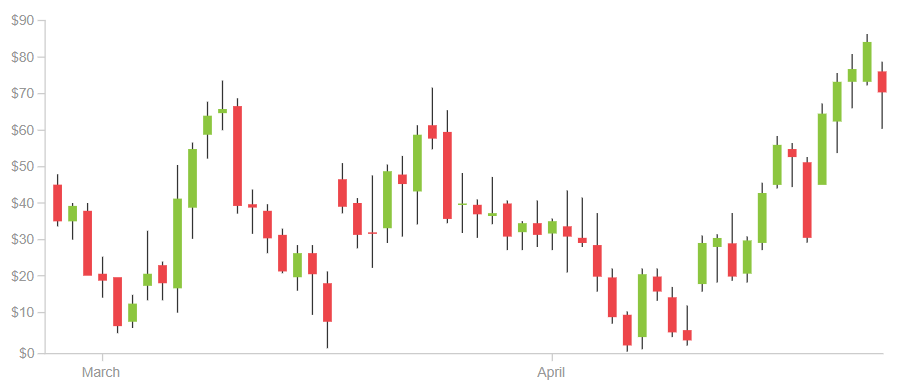
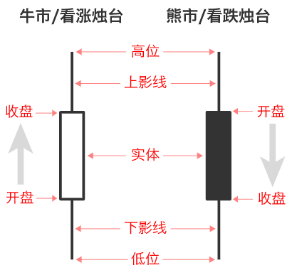
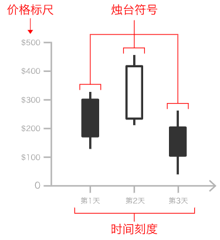
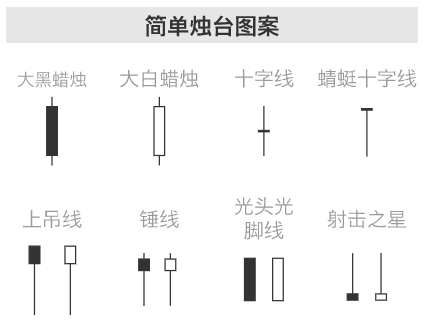

# Candlestack Chart

## 简介

烛台图，又称为日本K线图。

该图表通常用在交易中，用来显示和分析证券、衍生工具、外汇货币、股票、债券等商品随着时间价格的变动。

虽然烛台图中使用的符号类似于[箱线图](box_whisker.md)，但是两者功能不同，不要混淆。

烛台图使用类似烛台的符号显示多种价格信息，如开盘价、收盘价、最高价、最低价。每个符号表示单个时间段（如 minute, hour, day, month 等）的交易活动信息的压缩。每个烛台符号沿着时间轴绘制在 x 轴上，以显示一段时间内的交易活动。

烛台符号结构如下所示：

符号中的方框称为主体（real body），用于显示该时间段内开盘价和收盘价的范围。

延伸线称为上影线和下影线（lower shadow），用于表示该时间段内最高和最低交易价格。

当市场看涨（牛市，Bullish），即收盘价高于开盘价时，主体通常为白色或绿色；当市场看跌，即收盘价低于开盘价，主体通常为黑色或红色。

烛台图适合于预测一段时间内的市场趋势，通过烛台的颜色和形状解释当前市场行情。比如，主体越长，销售或购买的压力就越大；主体越短，表示该时间段内价格波动较小。

烛台图使用各种指标（形状、颜色）和图案帮助解释市场心理学，如买卖所双所经历的恐惧和贪婪。目前公认的模式有42种，分为简单模式和复杂模式，这些模式对于现实价格关系很有用，方便预测市场走势，[各种模式的说明](https://en.wikipedia.org/wiki/Candlestick_pattern)。

## 工具

- [d3](http://bl.ocks.org/abeppu/1074045)
- [plotly](https://plotly.com/python/candlestick-charts/)
