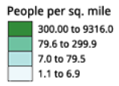

# Color

- [Color](#color)
  - [配色方案类型](#%e9%85%8d%e8%89%b2%e6%96%b9%e6%a1%88%e7%b1%bb%e5%9e%8b)
    - [Sequential scheme (顺序)](#sequential-scheme-%e9%a1%ba%e5%ba%8f)
    - [Diverging scheme (发散)](#diverging-scheme-%e5%8f%91%e6%95%a3)
    - [Qualitative scheme (定性)](#qualitative-scheme-%e5%ae%9a%e6%80%a7)
  - [References](#references)

2020-04-29, 16:23
*** *

## 配色方案类型

### Sequential scheme (顺序)

Sequential 配色方案适合于有序数据。该方案主要改变亮度，数值低的对应浅色，数值高的对应深色。

### Diverging scheme (发散)

Diverging 配色方案重视两端和中间临界值。legend 中间临界位置使用浅色，而最小值和最大值使用深色，且采用不同色调。

Diverging 方案适合于序列中间类别发生改变的情况，使用色调（hue）和亮度（lightness）的变化来强调数据中的临界值，如均值、中位数或零值。从临界值到两边颜色变深，以表示与临界值的差异。

> 虽然 Diverging 配色方案设计为对称的，不过对特定数据，可能需要将临界点想某一侧移动。例如，一张人口变化图可能包含两类人口降低和五类人口增长，此时的配色方案，临界点（0 变化）一侧需要两种颜色，另一侧两种颜色。此时可以选择一个10-色的配色方案，在人口降低一侧忽略三种颜色。

### Qualitative scheme (定性)

Qualitative 配色方案没有大小差异，不同类别通过色调区分。这类方案适合于分类数据。

大多数 Qualitative 配色方案依赖于色调差异，不同颜色之间亮度只有很小差别。下面两个方案例外，完全没有亮度变化：

- Paired Scheme

这个配色方案为每个色调提供了一对亮度（如浅绿和深绿）。对相关值可以使用该方案。

- Accent Scheme

用于强调某个区域或类别，底部的颜色使用比其它颜色更饱和、更深或更亮的颜色。对该类别，要避免强调不重要的类别。

## References

- [Color Brewer](https://colorbrewer2.org/)
