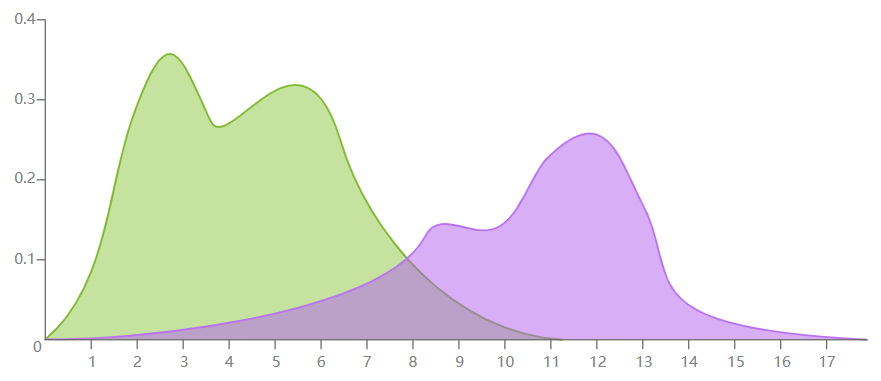
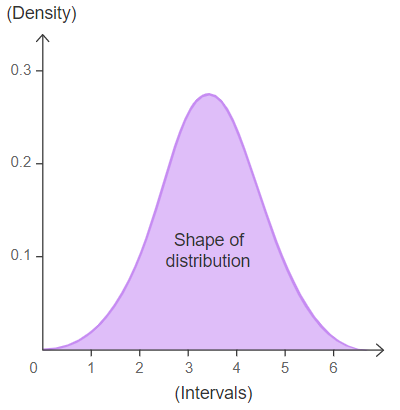

# Density Plot

## 简介

密度图（Density plot）又称为内核密度图（Kernel Density Plot）。

密度图显示连续区间或时间段内的数据分布。该图是[直方图](histogram.md)的变体，它使用内核函数平滑处理绘制值，使得整个分布更为平滑。密度图有助于查看整个时间区间的峰值。

密度图相对于直方图的一个优点是，它更方便确定分布的形状，因为它不收 bin 大小影响。在直方图中采用不同 bin 大小对分布的影响较大，但对密度图没影响。

## 工具

- [R cookbook](http://www.cookbook-r.com/Graphs/Histogram_and_density_plot/)
- [ggplot2](https://www.r-graph-gallery.com/21-distribution-plot-using-ggplot2)
- [seaborn](https://python-graph-gallery.com/density-plot/)
