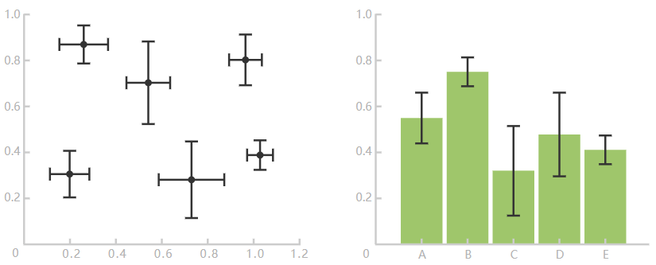
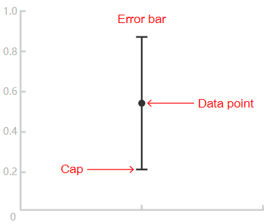
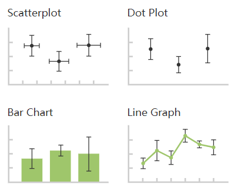

# Error Bars

## 简介

误差线（error bar）虽然不是图表，但是作为图表的增强功能，可以直观地显示笛卡尔坐标系上数据的变化。

误差线可应用于[散点图](scatter_plot.md)、[条形图](bar_chart.md)和[折线图](line_graph.md)等，为数据提供了额外信息。

误差线辅助指示估计的误差或不确定性，以大致了解测量的准确度。

误差线通常用于显示数据集的标准偏差、置信区间、最大值和最小值等。其结构如下所示：

误差线的长度揭示数据的不准确性：较短的误差线表示值集中，而较长的误差线表示值分布广，测量可能不大可靠。

误差线总是和定量值的坐标轴平行，如果有两个定律标尺，则可以针对两个轴使用误差线。

## 工具

- [plotly](https://plotly.com/chart-studio-help/make-a-graph-with-error-bars/)
