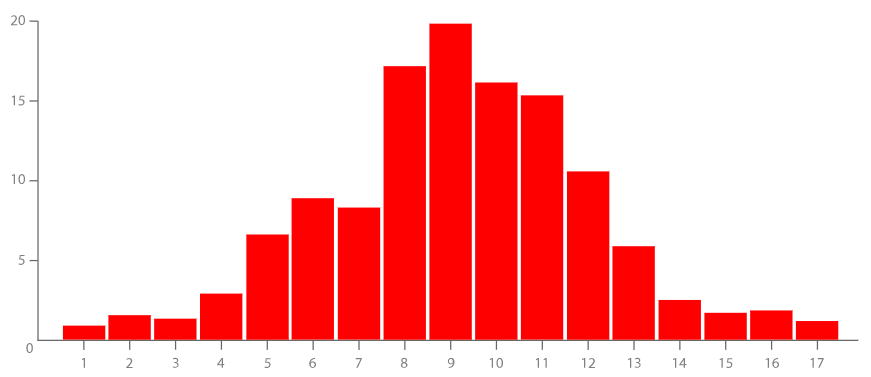

# Histogram

- [Histogram](#histogram)
  - [简介](#%e7%ae%80%e4%bb%8b)
  - [bin size](#bin-size)
  - [工具](#%e5%b7%a5%e5%85%b7)

***

## 简介

以图形方式展示 1D 数值型数据的分布。适合用来显示连续间隔或时间段内数据分布。

输入 1D 数值型数据，以指定宽度将变量划分为多个 bins，每个 bin 的高度表示该范围内数据的个数。直方图的面积等于数据的总量。

直方图有助于估计数值集中位置、上下极值以及是否存在差异、异常值，也可以粗略显示概率分布，其结构如下所示：

!histogram](images/2020-04-01-11-19-48.png)

每一个长条高度表示落在该区间内数据的个数。

## bin size

每个 bin 中数据的个数以 bar 的高度表示，所以不同的 bin 宽度，对结果展示很重要。

## 工具

- [d3](https://observablehq.com/@d3/bar-chart)
- [R](https://www.r-graph-gallery.com/83-histogram-with-colored-tail)
- [seaborn](https://python-graph-gallery.com/histogram/)
