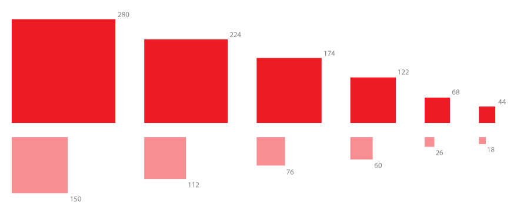
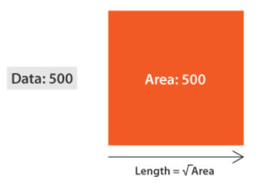

# Proportional Area Chart

## 简介

比例面积图非常适合显示比较值和比例（大小、数量等），方便快速的查看数据的相对大小或数量。

该图表的缺点是很难估算值，你不可能看大小就得到值的多少，所以它一般用于交流，而不是用于分析。

其结构如下所示：

比例面积图一般使用正方形和圆形，使用其它形状也可以，只要保证区域面积和数据成正比即可。

使用面积图的一个常见错误是用单边长度表示数据，而实际应当是图形面积。

## 工具

- [d3 bubble chart](https://observablehq.com/@d3/bubble-chart)