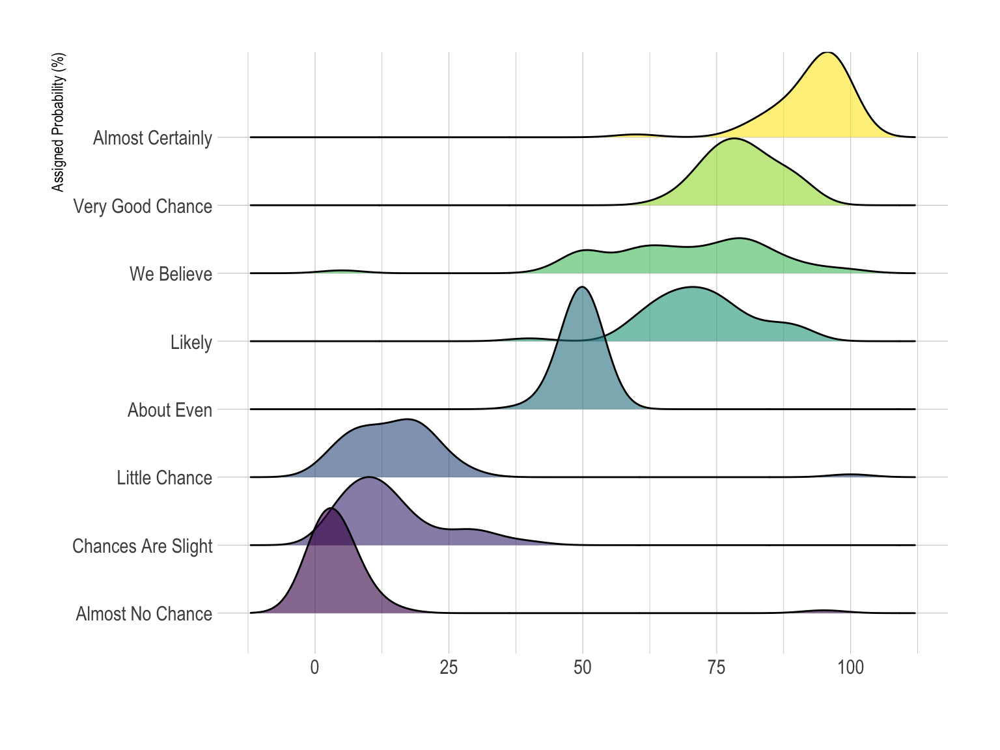
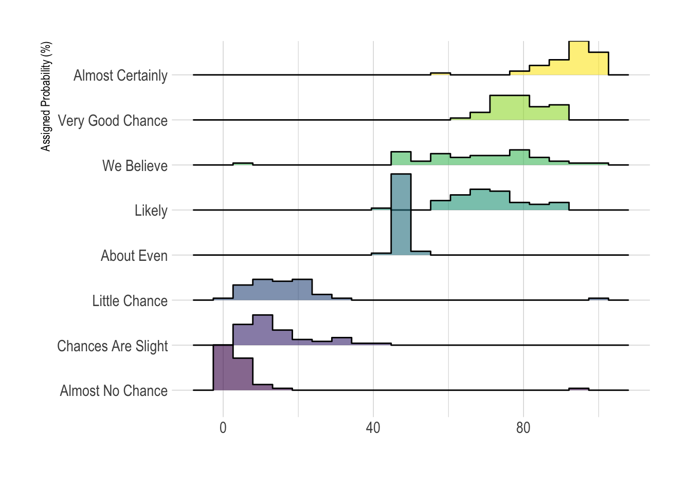

# Ridgeline

- [Ridgeline](#ridgeline)
  - [简介](#简介)
  - [应用](#应用)
  - [变体](#变体)

2020-06-08, 13:57
*** *

## 简介

脊线图（ridgeline plot），也称为 joyplot，用于显示多个分组的一个数值分布。可以用直方图或密度图来表示分布，所有直方图或密度图都对齐到同一个刻度线。

例如，下面是人们对不同短语对应概率的调查结果。

## 应用

当需要表示的分组很多，使用经典的图要占很多空间，此时可以使用脊线图。如果你的分组不多（< 6），可以考虑使用其它[分布图](0_toc.md)。

在分组数据有明显的规律效果会很好，否则分组之间互相重叠，会导致一些细节无法显示。

## 变体

上图中是使用密度图现实分布，也可以使用直方图：

