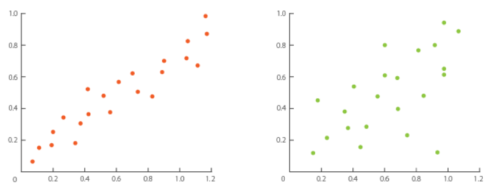
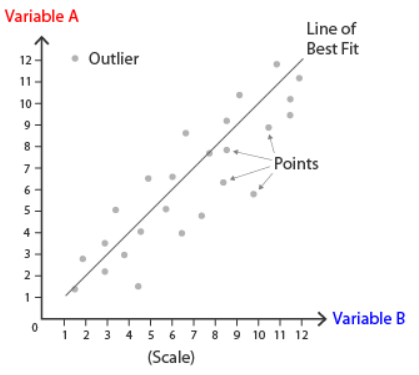
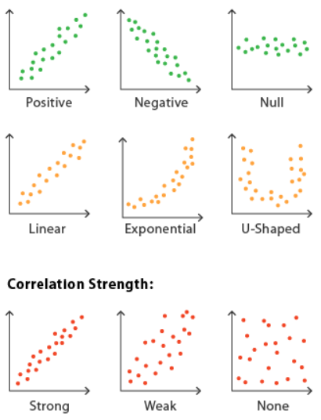

# Scatter Plot

## 简介

散点图（Scatter plot）也称为点图（Point Graph），X-Y 图（X-Y Plot）。

散点图将所有数据点放在笛卡尔坐标系中。两个轴分别对应一个变量，可以用来检测**两个变量**之间是否存在相关性。如下图所示：

通过散点图可以查看各种类型的相关性：

- 正相关（positive）
- 负相关（negative）
- 不相关
- 线性相关（linear）
- 指数相关（exponential）
- ...

相关性的程度可以通过图上点靠近程序判断。超出点集（cluster）之外的点成为离群值（outlier）。

还可以对数据点进行拟合，添加拟合曲线。

如果你正好有两个变量，并且需要查看两个变量是否相关，用散点图正好。

## 工具

- [d3](https://observablehq.com/@d3/scatterplot)
- [matplotlib](https://python-graph-gallery.com/scatter-plot/)
- [seaborn](https://python-graph-gallery.com/scatter-plot/)
