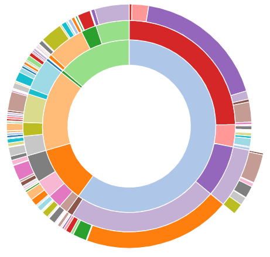
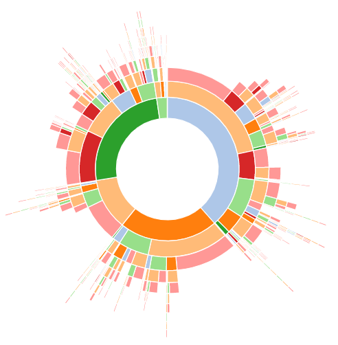

# Sunburst

- [Sunburst](#sunburst)
  - [简介](#%e7%ae%80%e4%bb%8b)
    - [总体组成](#%e6%80%bb%e4%bd%93%e7%bb%84%e6%88%90)
    - [流程](#%e6%b5%81%e7%a8%8b)
    - [主要缺点](#%e4%b8%bb%e8%a6%81%e7%bc%ba%e7%82%b9)
  - [绘制](#%e7%bb%98%e5%88%b6)

2020-04-27, 14:27
*** *

## 简介

sunburst （朝阳图）用于显示分层数据结构。根结点在圆圈中心，每下一层附加一个圆环。subburst 和[树形图](treemap.md) 非常相似，只是使用了放射状布局。

sunburst 可以在下面两种情况使用。

### 总体组成

例如，下面用 sunburst 来表示世界人口组成，依次按照大陆、区域、国家进行分化。在这个树形结构中，国家为叶结点，处于分支的末端。

```r
# libraries
library(tidyverse)
library(treemap)
library(sunburstR)

# Load dataset from github
data <- read.table("https://raw.githubusercontent.com/holtzy/data_to_viz/master/Example_dataset/11_SevCatOneNumNestedOneObsPerGroup.csv", header=T, sep=";")
data[ which(data$value==-1),"value"] <- 1
colnames(data) <- c("Continent", "Region", "Country", "Pop")

# Reformat data for the sunburstR package
data <- data %>%
  filter(Continent != "") %>%
  mutate(path = paste(Continent, Region, Country, sep="-")) %>%
  dplyr::select(path, Pop)

# Plot
p <- sunburst(data, legend=FALSE)
```



### 流程

sunburst 也可以用来表达流程，此时和[Sankey](sankey.md) 类似。例如，下面描述一组人的职业生涯变化：

```r
library(TraMineR)
library(sunburstR)
library(pipeR)

# use example from TraMineR vignette
data("mvad")
mvad.alphab <- c(
  "employment", "FE", "HE", "joblessness",
  "school", "training"
)
mvad.seq <- seqdef(mvad, 17:86, xtstep = 6, alphabet = mvad.alphab)

# to make this work, we'll compress the sequences with seqdss
#   could also aggregate with dply later
seqtab( seqdss(mvad.seq), tlim = 0, format = "SPS" ) %>>%
  attr("freq") %>>%
  (
    data.frame(
      # appending "-end" is necessary for this to work
      sequence = paste0(
        gsub(
          x = names(.$Freq)
          , pattern = "(/[0-9]*)"
          , replacement = ""
          , perl = T
        )
        ,"-end"
      )
      ,freq = as.numeric(.$Freq)
      ,stringsAsFactors = FALSE
    )
  ) %>>%
  sunburst ->p
```



### 主要缺点

- 标签难以标注，图也不是直观的能一眼看懂。
- 角度难以阅读，sunburst 存在和 [pie](pie_chart.md), [donut](pie_chart.md) 一样的问题，人阅读角度是存在困难的，因此很难通过角度估计值。
- 大小问题：越外层的slice越大，和值的大小不成比例。

## 绘制

- [plotly](../plotly/chart_sunburst.md)
