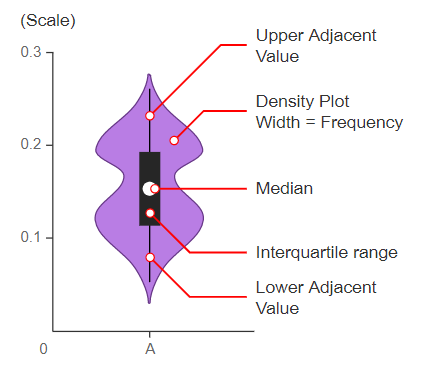

# Violin

## 简介

小提琴图（Violin plot）用于一个或多个分组的 numeric 变量的可视化。它类似于箱线图（boxplot），但在两侧增加了一个旋转的核密度图。是箱线图和密度分布（Density Plot）的组合。所以小提琴图可以方便的查看多组数据的分布和概率密度。

其结构如下所示：

说明：

- 中间的白点为中值
- 中间的黑色粗线为四分位间距
- 细黑线上下对应最大和最小值。

