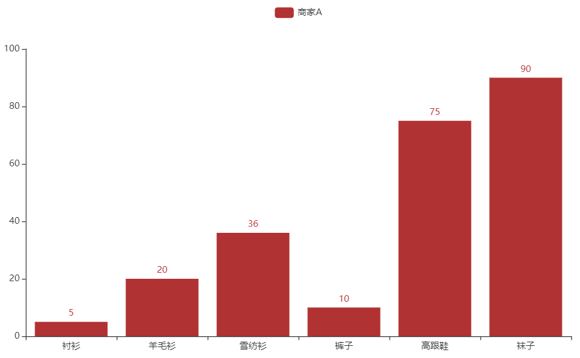
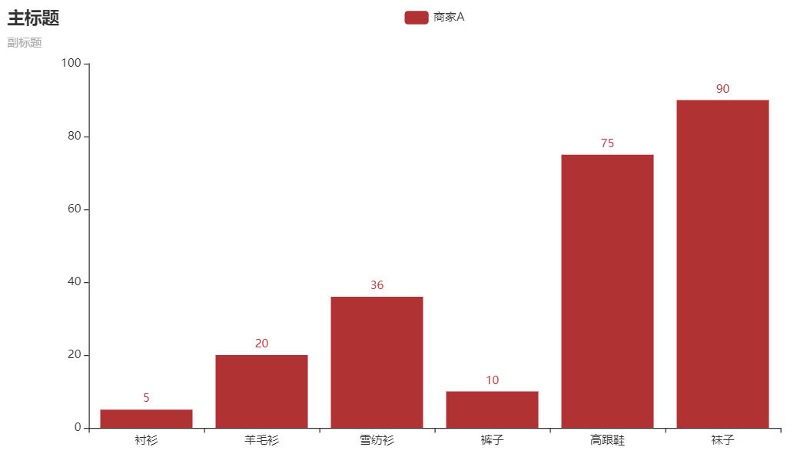
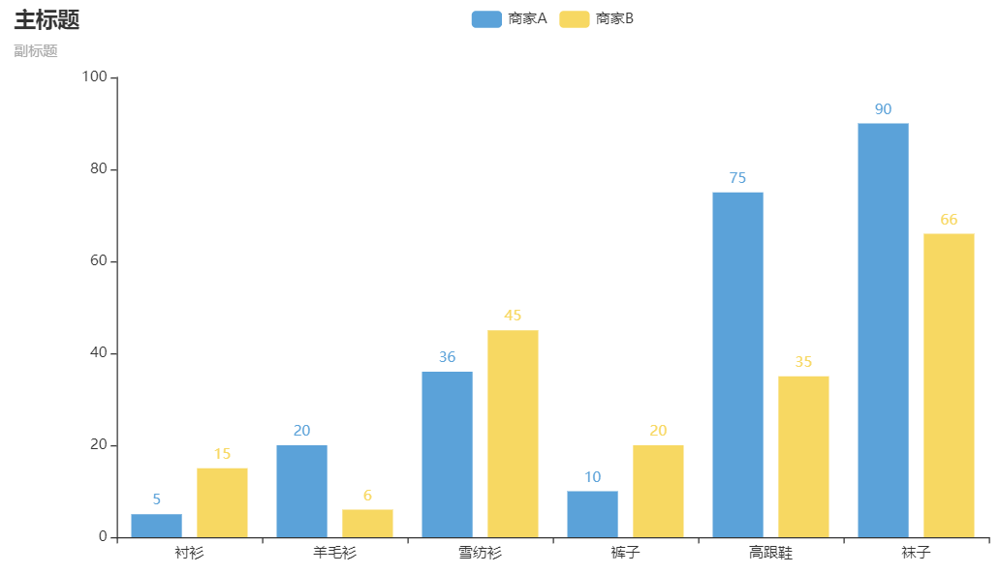

# 快速入门

2022-04-25, 19:15
****

## 第一个图表

```py
from pyecharts.charts import Bar

bar = Bar()
bar.add_xaxis(["衬衫", "羊毛衫", "雪纺衫", "裤子", "高跟鞋", "袜子"])
bar.add_yaxis("商家A", [5, 20, 36, 10, 75, 90])
# render 会生成本地 HTML 文件，默认会在当前目录生成 render.html 文件
# 也可以传入路径参数，如 bar.render("mycharts.html")
bar.render()
```



## 链式调用

pyecharts 所有方法都支持链式调用。

```py
from pyecharts.charts import Bar

bar = (
    Bar()
    .add_xaxis(["衬衫", "羊毛衫", "雪纺衫", "裤子", "高跟鞋", "袜子"])
    .add_yaxis("商家A", [5, 20, 36, 10, 75, 90])
)
bar.render()
```

效果同上。

## options 配置

在 pyecharts中，一切都用 options 配置。

```py
from pyecharts.charts import Bar
from pyecharts import options as opts

# V1 版本开始支持链式调用
# 你所看到的格式其实是 `black` 格式化以后的效果
# 可以执行 `pip install black` 下载使用
bar = (
    Bar()
    .add_xaxis(["衬衫", "羊毛衫", "雪纺衫", "裤子", "高跟鞋", "袜子"])
    .add_yaxis("商家A", [5, 20, 36, 10, 75, 90])
    .set_global_opts(title_opts=opts.TitleOpts(title="主标题", subtitle="副标题"))
    # 或者直接使用字典参数
    # .set_global_opts(title_opts={"text": "主标题", "subtext": "副标题"})
)
bar.render()

# 不习惯链式调用的开发者依旧可以单独调用方法
bar = Bar()
bar.add_xaxis(["衬衫", "羊毛衫", "雪纺衫", "裤子", "高跟鞋", "袜子"])
bar.add_yaxis("商家A", [5, 20, 36, 10, 75, 90])
bar.set_global_opts(title_opts=opts.TitleOpts(title="主标题", subtitle="副标题"))
bar.render()
```



## 渲染成图片

```py
from pyecharts.charts import Bar
from pyecharts.render import make_snapshot

# 使用 snapshot-selenium 渲染图片
from snapshot_selenium import snapshot

bar = (
    Bar()
    .add_xaxis(["衬衫", "羊毛衫", "雪纺衫", "裤子", "高跟鞋", "袜子"])
    .add_yaxis("商家A", [5, 20, 36, 10, 75, 90])
)
make_snapshot(snapshot, bar.render(), "bar.png")
```

## 主题

pyecharts 提供了 10+ 种内置主题，开发者也可以定制自己喜欢的主题。

```py
from pyecharts.charts import Bar
from pyecharts import options as opts
# 内置主题类型可查看 pyecharts.globals.ThemeType
from pyecharts.globals import ThemeType

bar = (
    Bar(init_opts=opts.InitOpts(theme=ThemeType.LIGHT))
    .add_xaxis(["衬衫", "羊毛衫", "雪纺衫", "裤子", "高跟鞋", "袜子"])
    .add_yaxis("商家A", [5, 20, 36, 10, 75, 90])
    .add_yaxis("商家B", [15, 6, 45, 20, 35, 66])
    .set_global_opts(title_opts=opts.TitleOpts(title="主标题", subtitle="副标题"))
)
```



> 在使用 Pandas&Numpy 时，请确保将数值类型转换为 python 原生的 int/float。比如整数类型请确保为 int，而不是 numpy.int32。
